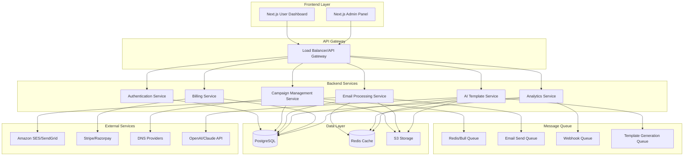
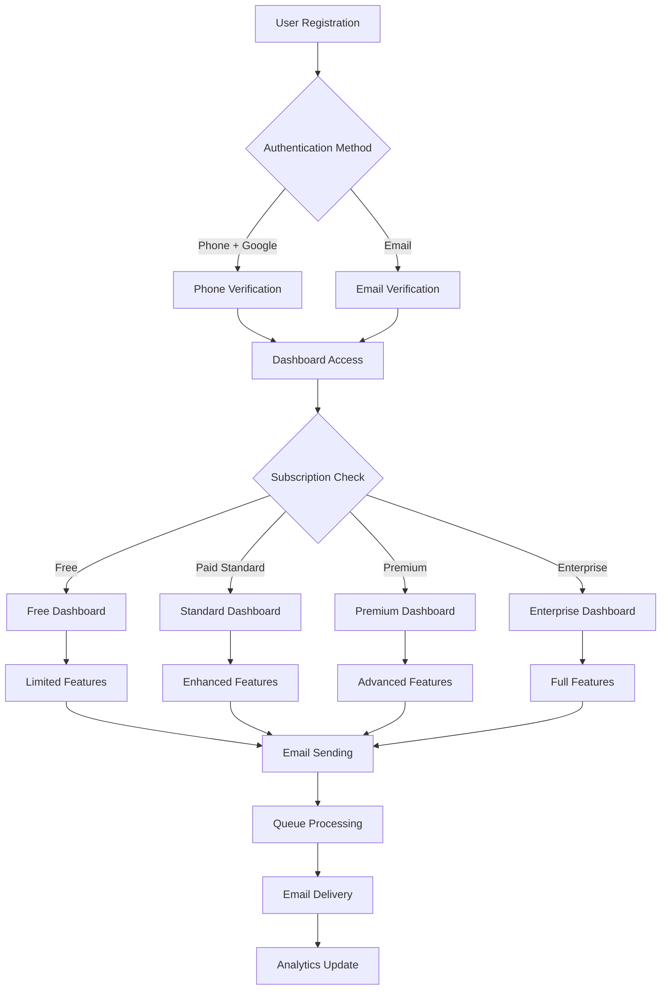

# Design Document

## Overview

The bulk email platform will be architected as a modern, scalable SaaS application with microservices principles. The system will support multi-tenancy, real-time analytics, and high-throughput email processing while maintaining strict compliance and deliverability standards.

### Key Design Principles
- **Separation of Concerns**: Clear boundaries between frontend, backend, and admin interfaces
- **Scalability**: Queue-based processing and horizontal scaling capabilities  
- **Reliability**: Fault-tolerant email delivery with retry mechanisms
- **Security**: Multi-layered security with encryption and authentication
- **Compliance**: Built-in regulatory compliance (GDPR, CAN-SPAM, DPDP)

## Architecture

### High-Level System Architecture



### User Flow Architecture



### Folder Structure

```
bulk-email-platform/
├── frontend/                 # Next.js user dashboard
│   ├── components/
│   ├── pages/
│   ├── hooks/
│   ├── utils/
│   └── styles/
├── admin-frontend/          # Next.js admin panel
│   ├── components/
│   ├── pages/
│   ├── hooks/
│   └── utils/
├── backend/                 # Node.js/Python/Rust API
│   ├── src/
│   │   ├── auth/
│   │   ├── campaigns/
│   │   ├── emails/
│   │   ├── analytics/
│   │   ├── billing/
│   │   └── shared/
│   ├── workers/
│   └── config/
├── shared/                  # Shared types and utilities
├── infrastructure/          # Docker, K8s, Terraform
└── docs/                   # API documentation
```

## Components and Interfaces

### 1. Authentication Service

**Responsibilities:**
- User registration and login
- JWT token management
- Role-based access control (RBAC)
- API key generation and validation

**Key Interfaces:**
```typescript
interface AuthService {
  register(userData: UserRegistration): Promise<User>
  login(credentials: LoginCredentials): Promise<AuthToken>
  generateApiKey(userId: string, scopes: string[]): Promise<ApiKey>
  validateToken(token: string): Promise<User>
}
```

### 2. Campaign Management Service

**Responsibilities:**
- Template creation and management
- Campaign scheduling and execution
- Contact list management
- A/B testing coordination

**Key Interfaces:**
```typescript
interface CampaignService {
  createTemplate(template: EmailTemplate): Promise<Template>
  createCampaign(campaign: CampaignData): Promise<Campaign>
  scheduleCampaign(campaignId: string, scheduleTime: Date): Promise<void>
  importContacts(file: File, listId: string): Promise<ImportResult>
}
```

### 3. Email Processing Service

**Responsibilities:**
- Queue management for email sends
- Integration with email service providers (ESP)
- Bounce and complaint handling
- Delivery tracking and webhooks

**Key Interfaces:**
```typescript
interface EmailService {
  queueEmail(email: EmailJob): Promise<string>
  processBatch(emails: EmailJob[]): Promise<BatchResult>
  handleWebhook(provider: string, payload: any): Promise<void>
  trackDelivery(messageId: string, event: DeliveryEvent): Promise<void>
}
```

### 4. Analytics Service

**Responsibilities:**
- Real-time metrics collection
- Dashboard data aggregation
- Report generation
- Performance analytics

**Key Interfaces:**
```typescript
interface AnalyticsService {
  recordEvent(event: EmailEvent): Promise<void>
  getCampaignMetrics(campaignId: string): Promise<CampaignMetrics>
  getDashboardData(userId: string, timeRange: TimeRange): Promise<DashboardData>
  generateReport(reportConfig: ReportConfig): Promise<Report>
}
```

### 5. Billing Service

**Responsibilities:**
- Subscription management
- Usage tracking and metering
- Payment processing
- Invoice generation

**Key Interfaces:**
```typescript
interface BillingService {
  createSubscription(userId: string, planId: string): Promise<Subscription>
  trackUsage(userId: string, usage: UsageData): Promise<void>
  processPayment(paymentData: PaymentData): Promise<PaymentResult>
  generateInvoice(subscriptionId: string): Promise<Invoice>
}
```

### 6. AI Template Service

**Responsibilities:**
- AI-powered template generation
- Template customization and management
- Template usage tracking per tier
- Integration with AI providers

**Key Interfaces:**
```typescript
interface AITemplateService {
  generateTemplate(prompt: string, userId: string): Promise<EmailTemplate>
  customizeTemplate(templateId: string, modifications: any): Promise<EmailTemplate>
  trackTemplateUsage(userId: string): Promise<TemplateUsage>
  validateTemplateQuota(userId: string): Promise<boolean>
}
```

### 7. Scheduled Email Service

**Responsibilities:**
- Email scheduling and queue management
- Automatic email sending without user intervention
- Subscription and balance validation before sending
- Trigger system for manual execution

**Key Interfaces:**
```typescript
interface ScheduledEmailService {
  scheduleEmail(email: ScheduledEmail): Promise<string>
  cancelScheduledEmail(scheduleId: string): Promise<void>
  processScheduledEmails(): Promise<void>
  triggerScheduledEmails(): Promise<ProcessResult>
  validateSchedulingLimits(userId: string, scheduleDate: Date): Promise<ValidationResult>
}
```

### 8. Logo and Branding Service

**Responsibilities:**
- Logo upload and storage management
- Branding customization and preview
- Logo placement and styling options
- Brand consistency across templates

**Key Interfaces:**
```typescript
interface BrandingService {
  uploadLogo(userId: string, logoFile: File): Promise<LogoUploadResult>
  updateBrandingSettings(userId: string, settings: BrandingSettings): Promise<void>
  generateBrandPreview(settings: BrandingSettings): Promise<PreviewResult>
  applyBrandingToTemplate(templateId: string, brandingId: string): Promise<EmailTemplate>
}
```

### Dashboard Page Structure

Based on the user flow analysis, each dashboard includes:

**Core Pages (All Tiers):**
- Home Page: Email sending functionality, template management
- Schedule Page: Campaign scheduling with status tracking (Delivery, Queue, Pending, Failed)
- Subscribers & History: Contact lists, unsubscribe management, email history
- Overview & Dashboard: Analytics with graphs and animations (daily, weekly, monthly, yearly)
- Settings & API: API keys, customization options, tier-specific features
- Usage & Billing: Usage metrics, billing history, recharge options
- Documentation & Library: API docs, integration guides, SDKs
- Contact Us: Support options, AI agent assistance, enterprise contact

**Tier-Specific Features:**
- Free: Basic functionality with ads, limited history (3 days)
- Paid Standard: Enhanced features, full history, logo customization
- Premium: Advanced features, custom domains, subscriber management
- Enterprise: Full customization, dedicated support, unlimited features

## Data Models

### Subscription Tiers and Pricing

Based on the detailed flow analysis, the platform supports four distinct tiers:

**Free Tier:**
- 100 emails per day
- 300 recipients per month  
- 2000 emails per month
- 1 AI template daily
- No logo customization
- Ads included in emails
- Website branding attached
- 3-day email history storage

**Paid Standard Tier (₹39-59 + GST):**
- 500-1000 emails per day
- 1500-5000 recipients per month
- 10000-30000 emails per month
- 10 AI/Custom templates daily
- Logo customization available
- Website branding attached
- Full email history storage

**Premium Tier (₹249-649 + GST):**
- 2000-5000 emails per day
- 10000-25000 recipients per month
- 50000-100000 emails per month
- Unlimited AI/Custom templates
- Logo customization
- 2-10 custom business emails
- Full subscriber management
- Complete email history

**Enterprise Tier (Customizable):**
- Customizable email limits per day
- Customizable recipients per month
- Customizable email quotas
- Unlimited templates
- Full customization options
- Unlimited custom business emails
- Advanced subscriber management
- Complete feature access

**Recharge Options:**
- All Users: 500 recipients for ₹10 (standardized pricing)
- Paid Standard: ₹50-1000 + GST (minimum recharge amounts)
- Premium: ₹1500-10000 + GST (minimum recharge amounts)
- Enterprise: Custom pricing

**Scheduling Limitations:**
- Subscription Users: Maximum 14 days in advance, cancelled if subscription expires
- Recharge Users: No time limit, cancelled if insufficient balance at send time

### Core Entities

```typescript
// User and Tenant Management
interface User {
  id: string
  email: string
  tenantId: string
  role: UserRole
  subscriptionTier: SubscriptionTier
  createdAt: Date
  lastLoginAt: Date
}

interface Tenant {
  id: string
  name: string
  domains: Domain[]
  quotas: TierQuotas
  settings: TenantSettings
  branding: BrandingSettings
}

// Scheduled Email Management
interface ScheduledEmail {
  id: string
  tenantId: string
  campaignId: string
  scheduledAt: Date
  status: ScheduleStatus
  userType: 'subscription' | 'recharge'
  estimatedCost?: number
  createdAt: Date
  cancelledAt?: Date
  sentAt?: Date
}

interface ScheduleStatus {
  PENDING: 'pending'
  CANCELLED: 'cancelled'
  SENT: 'sent'
  FAILED: 'failed'
}

// Logo and Branding Management
interface BrandingSettings {
  id: string
  tenantId: string
  logoUrl?: string
  logoPosition: 'header' | 'footer' | 'sidebar'
  primaryColor: string
  secondaryColor: string
  textColor: string
  fontFamily: string
  customCss?: string
  isActive: boolean
  createdAt: Date
  updatedAt: Date
}

interface LogoUploadResult {
  logoUrl: string
  thumbnailUrl: string
  fileSize: number
  dimensions: { width: number; height: number }
}

// Email Campaign Management
interface Campaign {
  id: string
  tenantId: string
  name: string
  templateId: string
  listIds: string[]
  status: CampaignStatus
  scheduledAt?: Date
  sentAt?: Date
  metrics: CampaignMetrics
}

interface EmailTemplate {
  id: string
  tenantId: string
  name: string
  subject: string
  htmlContent: string
  textContent: string
  variables: TemplateVariable[]
}

// Contact Management
interface Contact {
  id: string
  tenantId: string
  email: string
  firstName?: string
  lastName?: string
  customFields: Record<string, any>
  subscriptionStatus: SubscriptionStatus
  createdAt: Date
}

interface ContactList {
  id: string
  tenantId: string
  name: string
  description?: string
  contactCount: number
  segments: ListSegment[]
}

// Domain and Authentication
interface Domain {
  id: string
  tenantId: string
  domain: string
  status: DomainStatus
  dkimKey: string
  verificationRecords: DNSRecord[]
  verifiedAt?: Date
}

// Analytics and Events
interface EmailEvent {
  id: string
  messageId: string
  campaignId: string
  contactId: string
  eventType: EventType
  timestamp: Date
  metadata: Record<string, any>
}

// Billing and Subscriptions
interface Subscription {
  id: string
  tenantId: string
  planId: string
  status: SubscriptionStatus
  currentPeriodStart: Date
  currentPeriodEnd: Date
  usage: UsageMetrics
  dailyEmailLimit: number
  monthlyRecipientLimit: number
  monthlyEmailLimit: number
  templateLimit: number
  customDomainLimit: number
  rechargeBalance: number
}

interface SubscriptionTier {
  FREE: 'free'
  PAID_STANDARD: 'paid_standard'
  PREMIUM: 'premium'
  ENTERPRISE: 'enterprise'
}

interface UsageMetrics {
  dailyEmailsSent: number
  monthlyEmailsSent: number
  uniqueRecipients: number
  templatesCreated: number
  customDomainsUsed: number
  lastResetDate: Date
}
```

### Database Schema Design

**PostgreSQL Tables:**
- `tenants` - Multi-tenant isolation
- `users` - User accounts and authentication
- `subscriptions` - Billing and plan management
- `domains` - Custom domain configuration
- `contacts` - Contact information and preferences
- `contact_lists` - List management and segmentation
- `templates` - Email template storage
- `campaigns` - Campaign configuration and status
- `email_jobs` - Individual email send jobs
- `email_events` - Delivery and engagement tracking
- `api_keys` - API authentication tokens
- `scheduled_emails` - Scheduled email campaigns with timing and validation
- `branding_settings` - Logo and branding customization per tenant
- `logo_uploads` - Logo file storage and metadata
- `recharge_transactions` - Detailed recharge purchase history with recipient counts

**Redis Data Structures:**
- Rate limiting counters (per user/tenant)
- Session storage and caching
- Queue management for email processing
- Real-time analytics aggregation

## Error Handling

### Error Categories and Responses

1. **Authentication Errors (401)**
   - Invalid API keys
   - Expired tokens
   - Insufficient permissions

2. **Validation Errors (400)**
   - Invalid email addresses
   - Missing required fields
   - Malformed request data

3. **Rate Limiting Errors (429)**
   - API rate limits exceeded
   - Daily/monthly quota exceeded
   - Concurrent request limits

4. **Service Errors (500)**
   - ESP integration failures
   - Database connection issues
   - Queue processing errors

### Error Response Format

```typescript
interface ErrorResponse {
  error: {
    code: string
    message: string
    details?: Record<string, any>
    timestamp: string
    requestId: string
  }
}
```

### Retry and Fallback Strategies

- **Email Delivery**: Exponential backoff with multiple ESP providers
- **Webhook Delivery**: Retry with increasing intervals up to 24 hours
- **Database Operations**: Connection pooling with automatic failover
- **API Calls**: Circuit breaker pattern for external services

## Testing Strategy

### Unit Testing
- **Coverage Target**: 90%+ for business logic
- **Framework**: Jest (Node.js) or pytest (Python)
- **Focus Areas**: Service methods, data validation, business rules

### Integration Testing
- **Database Integration**: Test with real PostgreSQL instance
- **ESP Integration**: Mock external services with realistic responses
- **API Testing**: End-to-end API workflow validation

### Performance Testing
- **Load Testing**: Simulate high-volume email sending
- **Stress Testing**: Test system limits and failure modes
- **Scalability Testing**: Validate horizontal scaling capabilities

### Security Testing
- **Authentication**: Test JWT validation and API key security
- **Authorization**: Verify RBAC and tenant isolation
- **Input Validation**: SQL injection and XSS prevention
- **Rate Limiting**: Verify quota enforcement

### Email Deliverability Testing
- **Spam Score Testing**: Validate content against spam filters
- **Authentication Testing**: Verify SPF, DKIM, DMARC setup
- **Inbox Placement**: Test delivery to major email providers
- **Bounce Handling**: Validate bounce processing and suppression

## Security Considerations

### Data Protection
- **Encryption at Rest**: AES-256 for sensitive data
- **Encryption in Transit**: TLS 1.3 for all communications
- **PII Handling**: Minimal collection with secure storage
- **Data Retention**: Automated cleanup of old data

### Access Control
- **Multi-Factor Authentication**: Optional 2FA for enhanced security
- **Role-Based Access**: Granular permissions per user role
- **API Security**: Rate limiting and request signing
- **Tenant Isolation**: Strict data separation between tenants

### Compliance Framework
- **GDPR Compliance**: Data portability and right to deletion
- **CAN-SPAM Compliance**: Unsubscribe handling and sender identification
- **DPDP Compliance**: Indian data protection requirements
- **Audit Logging**: Comprehensive activity tracking

## Performance and Scalability

### Caching Strategy
- **Redis Caching**: Frequently accessed data and session storage
- **CDN Integration**: Static assets and template resources
- **Database Query Optimization**: Proper indexing and query planning

### Queue Management
- **Email Processing**: Separate queues for different priority levels
- **Batch Processing**: Efficient bulk operations for large campaigns
- **Dead Letter Queues**: Failed job handling and retry logic

### Monitoring and Observability
- **Application Metrics**: Response times, error rates, throughput
- **Infrastructure Metrics**: CPU, memory, disk, network usage
- **Business Metrics**: Email delivery rates, user engagement
- **Alerting**: Proactive notification of system issues

This design provides a robust foundation for building a scalable, secure, and compliant bulk email platform that meets all the specified requirements while maintaining flexibility for future enhancements.