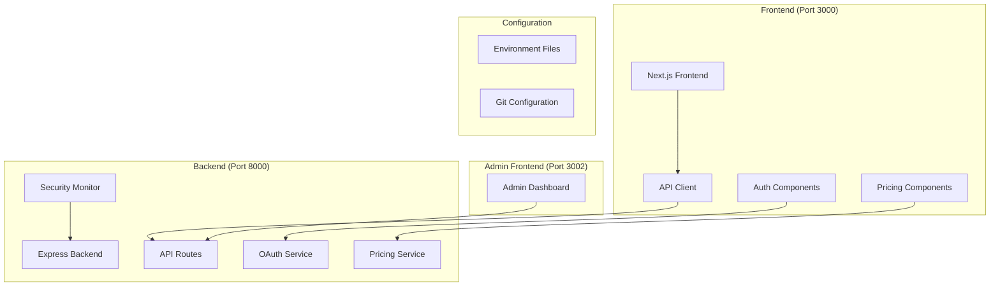

# Design Document

## Overview

This design addresses critical system stability issues affecting the entire application stack. The problems stem from multiple interconnected issues: incorrect API endpoint configuration, missing environment variables, improper Git configuration, missing Google OAuth implementation, security monitoring failures, and pricing validation problems. The solution involves systematic fixes across frontend, backend, and deployment configurations.

## Architecture

### Current Issues Analysis

1. **API Connection Problems**: Frontend is configured to connect to `localhost:3001/api` but backend runs on port 8000
2. **Environment Configuration**: Missing `.env` files and improper Git exclusion rules
3. **Google OAuth**: Missing implementation in frontend despite backend configuration
4. **Security Monitoring**: Errors in security monitoring service initialization
5. **Pricing Validation**: Missing server-side pricing validation endpoints
6. **Circuit Breaker**: Overly aggressive circuit breaker causing permanent failures

### Solution Architecture



## Components and Interfaces

### 1. Environment Configuration Service

**Purpose**: Ensure proper environment variable management and Git exclusion

**Interface**:
```typescript
interface EnvironmentConfig {
  frontend: {
    apiUrl: string;
    appUrl: string;
    googleClientId?: string;
  };
  backend: {
    port: number;
    databaseUrl: string;
    jwtSecret: string;
    googleClientSecret?: string;
  };
}
```

**Implementation**:
- Create missing `.env` files from `.env.example` templates
- Update Git configuration to properly exclude sensitive files
- Validate environment variable presence and format

### 2. API Connection Fix Service

**Purpose**: Resolve frontend-backend connectivity issues

**Interface**:
```typescript
interface ApiConnectionConfig {
  baseUrl: string;
  timeout: number;
  retryConfig: RetryConfig;
  circuitBreakerConfig: CircuitBreakerConfig;
}

interface RetryConfig {
  maxAttempts: number;
  baseDelay: number;
  maxDelay: number;
  backoffFactor: number;
}

interface CircuitBreakerConfig {
  failureThreshold: number;
  recoveryTimeout: number;
  halfOpenMaxCalls: number;
}
```

**Implementation**:
- Fix API base URL configuration (localhost:8000 instead of 3001)
- Adjust circuit breaker parameters to be less aggressive
- Improve error handling and user feedback
- Add proper health check endpoints

### 3. Google OAuth Integration Service

**Purpose**: Implement missing Google authentication functionality

**Interface**:
```typescript
interface GoogleOAuthConfig {
  clientId: string;
  redirectUri: string;
  scopes: string[];
}

interface GoogleOAuthService {
  initiateLogin(): Promise<string>;
  handleCallback(code: string): Promise<AuthResult>;
  getProfile(token: string): Promise<UserProfile>;
}
```

**Implementation**:
- Add Google OAuth buttons to login/signup pages
- Implement OAuth flow handling
- Connect to existing backend OAuth endpoints
- Handle authentication state management

### 4. Security Monitoring Fix Service

**Purpose**: Resolve security monitoring initialization errors

**Interface**:
```typescript
interface SecurityMonitorConfig {
  enableThreatDetection: boolean;
  alertEmail: string;
  webhookUrl?: string;
  logLevel: string;
}

interface SecurityMonitorService {
  initialize(): Promise<void>;
  startMonitoring(): void;
  stopMonitoring(): void;
  getStatus(): SecurityStatus;
}
```

**Implementation**:
- Fix security monitoring service initialization
- Resolve database connection issues for security logs
- Implement proper error handling and recovery
- Add monitoring dashboard functionality

### 5. Pricing Validation Service

**Purpose**: Implement server-side pricing validation

**Interface**:
```typescript
interface PricingService {
  validatePrices(): Promise<PriceValidationResult>;
  getCurrentPricing(): Promise<PricingData>;
  updatePricing(prices: PricingData): Promise<void>;
}

interface PricingData {
  plans: PricingPlan[];
  features: FeaturePricing[];
  lastUpdated: Date;
}
```

**Implementation**:
- Create pricing validation endpoints
- Implement server-side price verification
- Add caching for pricing data
- Create pricing management interface

### 6. AI Features Connection Service

**Purpose**: Fix AI feature connectivity and error handling

**Interface**:
```typescript
interface AIConnectionService {
  checkConnectivity(): Promise<boolean>;
  validateApiKeys(): Promise<ValidationResult>;
  handleConnectionErrors(error: Error): ErrorResponse;
}
```

**Implementation**:
- Add proper internet connectivity checks
- Validate AI service API keys
- Implement graceful degradation for offline scenarios
- Add user-friendly error messages

## Data Models

### Environment Configuration
```typescript
interface EnvironmentData {
  id: string;
  environment: 'development' | 'staging' | 'production';
  variables: Record<string, string>;
  isValid: boolean;
  lastValidated: Date;
}
```

### Connection Status
```typescript
interface ConnectionStatus {
  service: string;
  status: 'connected' | 'disconnected' | 'error';
  lastCheck: Date;
  errorMessage?: string;
  responseTime?: number;
}
```

### Security Event
```typescript
interface SecurityEvent {
  id: string;
  type: 'authentication' | 'authorization' | 'threat' | 'error';
  severity: 'low' | 'medium' | 'high' | 'critical';
  message: string;
  timestamp: Date;
  resolved: boolean;
}
```

## Error Handling

### 1. API Connection Errors
- Implement exponential backoff with jitter
- Add circuit breaker with configurable thresholds
- Provide clear user feedback for connection issues
- Log detailed error information for debugging

### 2. Authentication Errors
- Handle OAuth flow errors gracefully
- Provide fallback authentication methods
- Clear error messages for users
- Secure error logging without exposing sensitive data

### 3. Security Monitoring Errors
- Graceful degradation when monitoring fails
- Alternative logging mechanisms
- Alert administrators of monitoring failures
- Maintain core functionality when monitoring is down

### 4. Environment Configuration Errors
- Validate environment variables on startup
- Provide clear error messages for missing variables
- Fail fast with descriptive error messages
- Guide developers to fix configuration issues

## Testing Strategy

### 1. Unit Tests
- Test API client retry logic and circuit breaker
- Test environment configuration validation
- Test OAuth flow components
- Test security monitoring initialization
- Test pricing validation logic

### 2. Integration Tests
- Test frontend-backend API connectivity
- Test complete OAuth authentication flow
- Test security monitoring end-to-end
- Test pricing data flow from backend to frontend
- Test AI feature connectivity and error handling

### 3. End-to-End Tests
- Test complete user registration/login flow
- Test Google OAuth authentication
- Test pricing display and validation
- Test AI feature usage with connectivity issues
- Test system recovery after connection failures

### 4. Configuration Tests
- Test environment variable loading
- Test Git exclusion rules
- Test different environment configurations
- Test missing configuration handling

### 5. Performance Tests
- Test API response times under load
- Test circuit breaker behavior under stress
- Test retry logic performance impact
- Test security monitoring performance

### 6. Security Tests
- Test OAuth implementation security
- Test environment variable exposure
- Test security monitoring effectiveness
- Test error message information disclosure